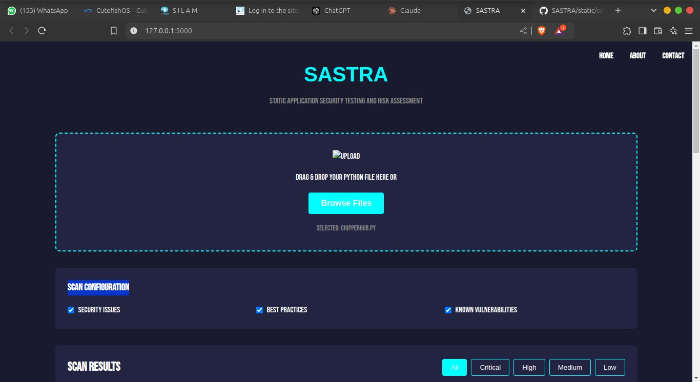
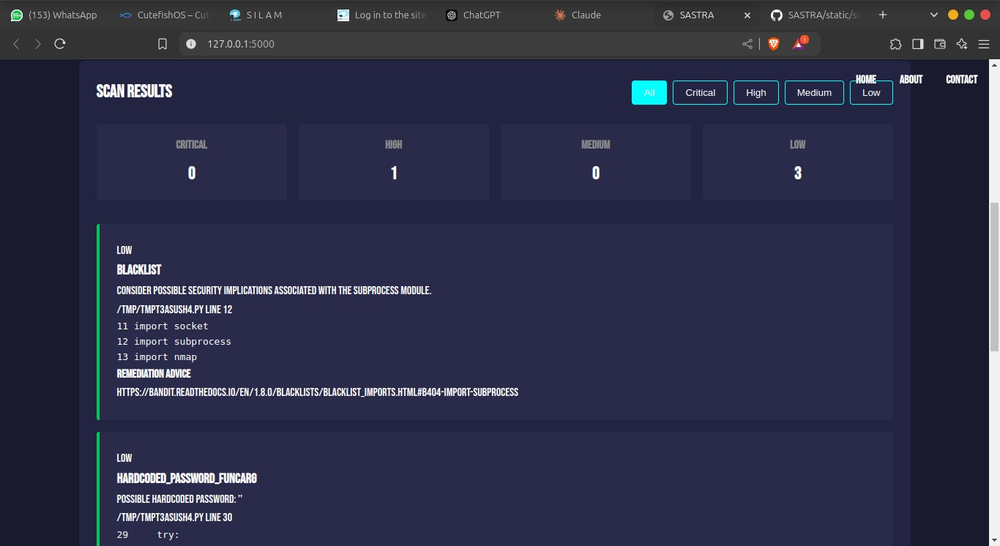

# SASTRA (Security Analysis Scanning Tool)

SASTRA is a web-based security analysis tool that helps developers identify potential security vulnerabilities in Python code. It provides an intuitive interface for uploading and scanning Python files, offering detailed reports with severity levels and remediation advice.

<div align="center">
  
  
  
</div>

## Features

- 🔍 Static code analysis for Python files
- 🚀 Real-time progress tracking
- 📊 Detailed vulnerability reports
- 🏷️ Severity-based categorization (Critical, High, Medium, Low)
- 💡 Remediation advice for each finding
- 📱 Responsive web interface
- 🎯 File drag-and-drop support
- 📝 Detailed code snippets with line numbers

## Prerequisites

Before running SASTRA, make sure you have the following installed:

- Python 3.7+
- pip (Python package manager)
- Node.js and npm (for frontend development)

## Installation

1. Clone the repository:
```bash
git clone https://github.com/paizy-hub/SASTRA.git
cd SASTRA
```

2. Install Python dependencies:
```bash
pip install -r requirements.txt
```

3. Install Bandit (security scanner):
```bash
pip install bandit
```

## Usage

1. Start the Flask server:
```bash
python app.py
```

2. Open your web browser and navigate to:
```
http://localhost:5000
```

3. Use the interface to:
   - Drag and drop Python files or click to browse
   - View scan progress in real-time
   - Review detailed security findings
   - Filter results by severity
   - Access remediation advice

## Project Structure

```
SASTRA/
├── app.py              # Flask backend application
├── static/            
│   ├── css/           # Stylesheets
│   ├── js/            # JavaScript files
│   └── img/           # Images and icons
├── templates/         
│   └── index.html     # Main HTML template
└── requirements.txt   # Python dependencies
```

## Technical Details

### Backend (Python/Flask)
- Flask web framework for the backend server
- Bandit security scanner integration
- Temporary file handling for secure scanning
- JSON response formatting
- Error handling and logging

### Frontend (JavaScript/HTML/CSS)
- Modern JavaScript (ES6+)
- Drag and drop file upload
- Progress bar animation
- Dynamic result rendering
- Severity-based filtering
- Responsive design

## Security Features

- File type validation (.py files only)
- File size limits (16MB max)
- Secure file handling with temporary storage
- Input sanitization
- XSS prevention
- Proper error handling and logging

## Contributing

1. Fork the repository
2. Create your feature branch (`git checkout -b feature/AmazingFeature`)
3. Commit your changes (`git commit -m 'Add some AmazingFeature'`)
4. Push to the branch (`git push origin feature/AmazingFeature`)
5. Open a Pull Request

## License

This project is licensed under the MIT License - see the [LICENSE](LICENSE) file for details.

## Acknowledgments

- [Bandit](https://github.com/PyCQA/bandit) - The Python security scanner
- [Flask](https://flask.palletsprojects.com/) - The web framework used
- [Tailwind CSS](https://tailwindcss.com/) - For the UI components

## Contact

Project Link: [https://github.com/paizy-hub/SASTRA](https://github.com/paizy-hub/SASTRA)
---
